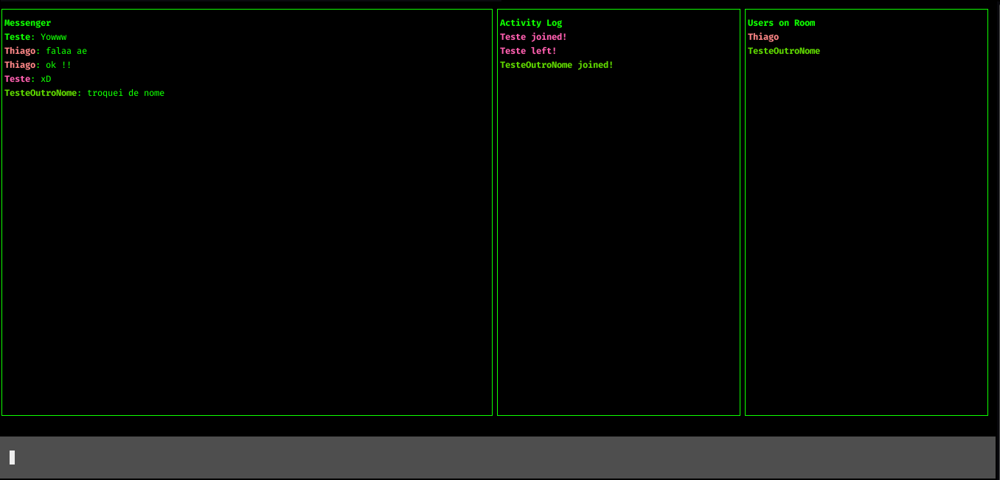

<h1 align="center"> chat-js </h1>

<h1 align="center" >
  
</h1>

## Technologies

- [Javascript](https://developer.mozilla.org/pt-BR/docs/Web/JavaScript)
- [blessed](https://github.com/chjj/blessed)


## Run project client

Clone the project and access the folder.

```bash
$ git clone git@github.com:ThiLourenco/chat-js.git
$ cd chat-js
```

- [Node.js](https://nodejs.org/en/)
- Package Manage ([Npm](https://www.npmjs.com/) ou [Yarn](https://yarnpkg.com/))

Follow the steps below:

```bash
# Run project client
$ npm i -g @thidotl17/hacker-chat-client@1.0.0 
# Start the project
$ hacker-chat --username 'username' --room 'nameRoom'

Exemple: 

hacker-chat \
  --username annon \
  --room sala01 \
```

## 📝 License

This project is licensed under the MIT License. See the [LICENSE](LICENSE.md) file for details.

---

<p align="center">Create by Thiago Lourenço</p>